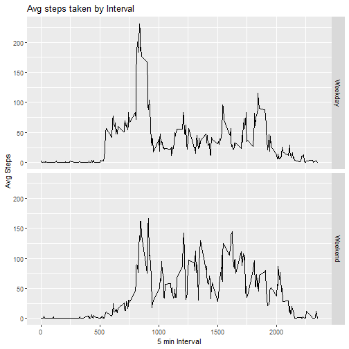

Reproducible Research Project - Week 2
======================================

## Loading and Preprocessing Data

```r
data <- read.csv('activity.csv',header=T)
data$date <- as.Date(data$date,'%Y-%m-%d')
```

## What is mean total number of steps taken per day?
### Histogram of the total number of steps taken each day

```r
library(dplyr)
totStep_byDay <- data %>% group_by(date) %>% summarize(sumSteps = sum(steps,na.rm = T))
```

```
## `summarise()` ungrouping output (override with `.groups` argument)
```

```r
totStep_byDay <- as.data.frame(totStep_byDay)

hist(totStep_byDay$sumSteps,main = 'Histogram of Daily Steps',xlab='Steps',
     col='Blue',ylim=c(0,30))
```


```r
meanStep_byDay <- round(mean(totStep_byDay$sumSteps),2)
medianStep_byDay <- round(median(totStep_byDay$sumSteps),2)
print(paste("Mean steps for the period: ",meanStep_byDay))
```

```
## [1] "Mean steps for the period:  9354.23"
```

```r
print(paste("Median steps for the period: ",medianStep_byDay))
```

```
## [1] "Median steps for the period:  10395"
```

## What is the average daily activity pattern?
### Time series plot 5-min interval vs Avg number of steps

```r
avgStep_byInterval <- data %>% group_by(interval) %>% summarize(avgSteps = round(mean(steps,na.rm = T),2))
```

```
## `summarise()` ungrouping output (override with `.groups` argument)
```

```r
avgStep_byInterval <- as.data.frame(avgStep_byInterval)

plot(avgStep_byInterval$avgSteps~avgStep_byInterval$interval,col='Red',
     type='l',xlab='5 min Interval',ylab='Avg Steps',main='Step by Time Interval')
```


```r
totStep_byInterval <- data %>% group_by(interval) %>% summarize(totSteps = sum(steps,na.rm = T))
```

```
## `summarise()` ungrouping output (override with `.groups` argument)
```

```r
totStep_byInterval <- as.data.frame(totStep_byInterval)

maxInt <- totStep_byInterval[which.max(totStep_byInterval[,'totSteps']),1]
print(paste("5-minute interval with max no. of steps: ",maxInt))
```

```
## [1] "5-minute interval with max no. of steps:  835"
```

## Imputing Missing Values
### Total number of missing values in dataset(total rows with NA)

```r
print(paste('Total no. of missing values in dataset: ',sum(is.na(data$steps))))
```

```
## [1] "Total no. of missing values in dataset:  2304"
```

### Imputing the NA values - mean of 5 min Interval used for data imputing

```r
new_df <- data
for (i in unique(new_df$interval)){
  temp_df <- new_df[new_df['interval']==i,]
  rowsToImp <- rownames(temp_df[is.na(temp_df[,1]),])
  new_df[rowsToImp,'steps'] <- mean(new_df[new_df['interval']==i,1],na.rm = T)
}
print('NA values in columns in new data frame:')
```

```
## [1] "NA values in columns in new data frame:"
```

```r
colSums(is.na(new_df))
```

```
##    steps     date interval 
##        0        0        0
```

### Histogram of Total Steps taken per day

```r
totStep_byDay_new <- new_df %>% group_by(date) %>% summarize(sumSteps = sum(steps,na.rm = T))
```

```
## `summarise()` ungrouping output (override with `.groups` argument)
```

```r
totStep_byDay_new <- as.data.frame(totStep_byDay_new)

hist(totStep_byDay_new$sumSteps,main = 'Histogram of Daily Steps',xlab='Steps',
     col='Blue',ylim=c(0,30))
```


### Mean and Median of Steps taken per day

```r
meanStep_byDay_new <- round(mean(totStep_byDay_new$sumSteps),2)
medianStep_byDay_new <- round(median(totStep_byDay_new$sumSteps),2)
print(paste("Mean steps for the period: ",meanStep_byDay_new))
```

```
## [1] "Mean steps for the period:  10766.19"
```

```r
print(paste("Median steps for the period: ",medianStep_byDay_new))
```

```
## [1] "Median steps for the period:  10766.19"
```

## Are there differences in activity patterns between weekdays and weekends?
### New factor variable: day type - Weekday / Weekend

```r
new_df$day <- weekdays(new_df$date)
new_df$dayType <- weekdays(new_df$date)
for (i in seq(nrow(new_df))){
  if((new_df[i,'day'] == 'Saturday') | (new_df[i,'day'] == 'Sunday')){
    new_df[i,'dayType'] <- 'Weekend'
  }else{
    new_df[i,'dayType'] <- 'Weekday'
  }
}
```

### Panel plot containing time series: 5-min interval vs Avg number of steps

```r
library(ggplot2)
avgStep <- new_df %>% group_by(interval,dayType) %>% summarize(avgSteps = round(mean(steps,na.rm = T),2))
```

```
## `summarise()` regrouping output by 'interval' (override with `.groups` argument)
```

```r
avgStep <- as.data.frame(avgStep)

qplot(interval,avgSteps,data= avgStep,facets = dayType~.,geom='line',
      xlab = '5 min Interval',ylab = 'Avg Steps',main='Avg steps taken by Interval')
```


